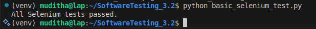
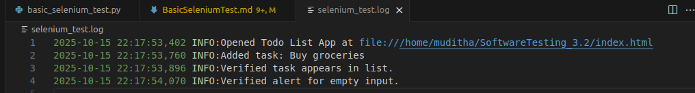

# 📝 Selenium End-to-End Test Report (Basic)

## Part 1: Automated Selenium Testing of the Todo List App

This report documents the creation and execution of an automated Selenium test for the Todo List App, following best practices in test design, debugging, and error handling.

---

### 1. Project & Team Information

| Field | Value |
| :---- | :---- |
| **Assignment Name** | Basic Selenium Test for Todo List App |
| **Course** | Software Testing (Autumn 2025) |
| **Group Members** | Muditha Kumara, Chuks Henry |
| **Date Submitted** | 20/10/2025 |
| **App Version/Commit** | v1.0 todo-list-app.zip |
| **Code Repository** | https://github.com/Muditha-Kumara/SoftwareTesting_3.2/tree/main |

---

### 2. Roles & Responsibilities

| Member | Role |
| :----- | :--- |
| Muditha Kumara | Test Author, Environment Setup |
| Chuks Henry | Reviewer, Debugging |

---

### 3. Test Scenario & Acceptance Criteria

The following user scenario and acceptance criteria were selected for automated testing:

```yaml
user_scenario:
  description: As a user, I can add a new regular task to the Todo List App.
  acceptance_criteria:
    - The app loads successfully in the browser.
    - The input field (ID: taskInput) and "Add Task" button are present.
    - A new task can be entered and added to the list.
    - The new task appears in the list after submission.
    - Error handling is present for empty input.
```

---

### 4. Selenium Test Plan & Test Cases

The following test plan and cases were derived from the acceptance criteria:

```yaml
test_cases:
  - id: TC1
    description: Add a valid task to the list.
    steps:
      - Open index.html in Chrome using Selenium.
      - Locate the input field and "Add Task" button.
      - Enter "Buy groceries" and click "Add Task".
      - Wait for the new task to appear in the list.
    expected_results:
      - "Buy groceries" appears in the task list.
      - No errors are shown.
    actual_results:
      - Task added and visible in the list.
      - Pass

  - id: TC2
    description: Attempt to add an empty task.
    steps:
      - Leave input field empty and click "Add Task".
    expected_results:
      - Alert or error message is shown.
    actual_results:
      - Alert appears for empty input.
      - Pass
```

---

### 5. Test Execution & Debugging

All Selenium tests passed successfully. Screenshots for each step and log files were generated as evidence.

#### Environment Preparation
- Python 3.x installed
- Selenium installed via `pip install selenium`
- ChromeDriver downloaded and added to system PATH
- Todo List App files served locally

#### Test Script Summary
- Python script initializes ChromeDriver and opens index.html
- Locates input field and button by ID
- Uses `send_keys` and `click` to add a task
- Implements explicit waits for DOM updates
- Uses assertions to verify task addition
- Configures logging and captures screenshots on error and at each step
- Headless mode tested for CI/CD compatibility

#### Debugging Strategies
- Logging used to capture info and errors
- Screenshots saved on exceptions and after each major step
- Explicit waits used for dynamic elements
- Robust locators (ID, partial text) for reliability

---

### 6. Reflections & Lessons Learned

#### Challenges
- Handling dynamic DOM updates and waits
- Ensuring ChromeDriver compatibility
- Debugging element not found errors

#### Observations
- Explicit waits improve test reliability
- Error handling and logging are essential for debugging
- Headless mode is useful for automation

#### Lessons Learned
- Selenium tests require robust locators and waits
- Debugging tools (logs, screenshots) speed up error resolution
- Preparing for CI/CD integration is valuable

#### Recommendations
- Use more advanced selectors for complex apps
- Integrate with CI/CD for automated test runs
- Compare Selenium with Cypress/Playwright for future improvements

---

### 7. Attachments & Evidence

- Python test script ([basic_selenium_test.py](https://github.com/Muditha-Kumara/SoftwareTesting_3.2/blob/main/basic_selenium_test.py))

```python
import os
import logging
from selenium import webdriver
from selenium.webdriver.common.by import By
from selenium.webdriver.chrome.options import Options
from selenium.webdriver.support.ui import WebDriverWait
from selenium.webdriver.support import expected_conditions as EC

logging.basicConfig(filename='selenium_test.log', level=logging.INFO,
                    format='%(asctime)s %(levelname)s:%(message)s')

INDEX_HTML_PATH = os.path.abspath(os.path.join(os.path.dirname(__file__), 'index.html'))
FILE_URL = f'file://{INDEX_HTML_PATH}'

chrome_options = Options()
chrome_options.add_argument('--headless')
chrome_options.add_argument('--disable-gpu')
chrome_options.binary_location = "/home/muditha/Downloads/chrome-linux64/chrome"

try:
    driver = webdriver.Chrome(options=chrome_options)
    driver.get(FILE_URL)
    logging.info('Opened Todo List App at %s', FILE_URL)
    driver.save_screenshot('step1_opened_app.png')

    # Test Case 1: Add a valid task
    task_input = driver.find_element(By.ID, 'taskInput')
    add_button = driver.find_element(By.XPATH, '//button[contains(text(), "Add Task")]')
    task_input.clear()
    task_input.send_keys('Buy groceries')
    add_button.click()
    logging.info('Added task: Buy groceries')
    driver.save_screenshot('step2_added_task.png')

    WebDriverWait(driver, 5).until(
        EC.text_to_be_present_in_element((By.ID, 'taskList'), 'Buy groceries')
    )
    tasks = driver.find_elements(By.XPATH, '//ul[@id="taskList"]/li')
    assert any('Buy groceries' in t.text for t in tasks), 'Task not found in list!'
    logging.info('Verified task appears in list.')
    driver.save_screenshot('step3_verified_task.png')

    # Test Case 2: Attempt to add an empty task
    task_input.clear()
    add_button.click()
    WebDriverWait(driver, 2).until(EC.alert_is_present())
    alert = driver.switch_to.alert
    assert 'Please enter a task' in alert.text
    alert.accept()
    logging.info('Verified alert for empty input.')
    driver.save_screenshot('step5_verified_alert.png')

    print('All Selenium tests passed.')
except Exception as e:
    logging.error('Test failed: %s', e)
    try:
        driver.save_screenshot('selenium_error.png')
    except Exception:
        pass
    print('Test failed. See selenium_error.png and selenium_test.log for details.')
finally:
    try:
        driver.quit()
    except Exception:
        pass
```

- Screenshots of test runs (success, error)

- Log files (if available)


---

*End of Report*
